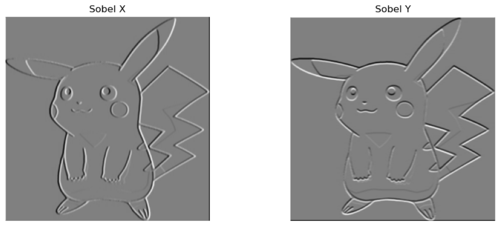
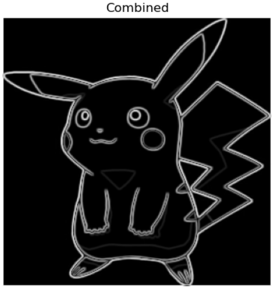
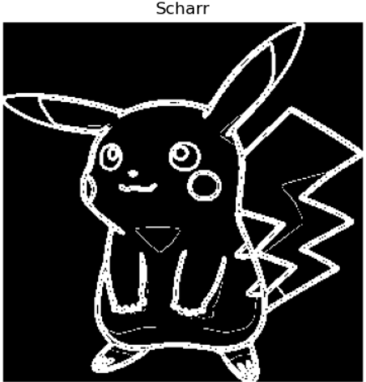
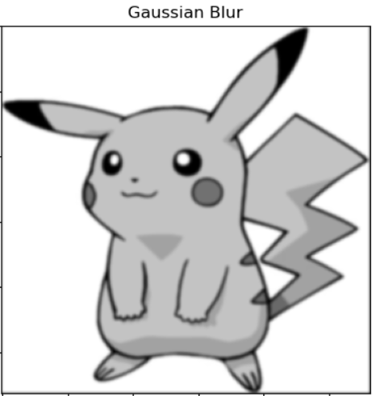
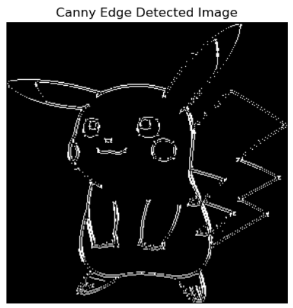

# Edge Detection Assignment

<p align="center">
  
</p>

### Convolve Function
First, I created a function to perform the convolve operation. It takes in the original image, a manually defined kernel, and also a boolean padding, which is ```True``` by default. I tried to implement different strides, but eventually ended up keeping a default stride of 1.
```python
def conv(img, kernel, padding=True):
    n = img.shape[0]
    k = kernel.shape[0]

    if padding:
        p = (k - 1) // 2
        padded_img = np.pad(img, pad_width=p, mode='constant', constant_values=0)
    else:
        padded_img = img

    output_size = n if padding else (n - k + 1)
    output = np.zeros((output_size, output_size))

    # Perform convolution
    for i in range(output_size):
        for j in range(output_size):
            region = padded_img[i:i+k, j:j+k]
            output[i, j] = np.sum(region * kernel)

    return output
```

Then I proceeded to implement various kernels and see the results

### 1. Sobel Kernel
The Sobel kernel constitutes of two matrices, one for finding edges in the x direction and the other for the y direction. Both these matrices are 3x3 matrices of the form:
```python
sobel_kx = np.array([[-1, 0, 1],
                     [-2, 0, 2],
                     [-1, 0, 1]])

sobel_ky = np.array([[-1, -2, -1],
                     [0, 0, 0],
                     [1, 2, 1]])
```
I then checked how the original image would turn out if only X and Y kernels were implemented separately.


I observed that in the Sobel_X, the edges in the original image that were parallel to the horizontal axis were not very visible. Similarly for Y. For example, in Sobel X, the horizontal edge in the triangular region under the chin is not very visible.

This can be resolved by combining the two gradients into one, which I have done in the code.




### 2. Scharr Kernel
I followed a similar process for the Scharr Kernel as well, and compared the images that were formed. I, however didn't mostly observe a lot of difference between the Scharr and the Sobel images.


However, thresholding the image sharpened the image edges and made them more visible


I performed the similar process for yet another kernel, the Prewitt kernel which also yielded a similar result.

Then I went ahead to Canny Edge Detection

### Canny Edge Detection
The canny edge detection was an algorithm by John Canny which got very popular due to its success in detecting edges in a wide range of images.

#### Step 1: Grayscale conversion
Since the edges that we detect is independant of colour, we convert it to grayscale. We only need to detect the gradient in the intensity, so colour is irrelevant.

#### Step 2: Gaussian Blur
Gaussian blur involves applying the gaussian kernel over the image. It results in a smoothened version of the input image. This is particularly useful in case the image has noise, in which case we might accidentally detect the noise as edges.
```python
gaussian_kernel = (1/273) * np.array([
    [1,  4,  7,  4, 1],
    [4, 16, 26, 16, 4],
    [7, 26, 41, 26, 7],
    [4, 16, 26, 16, 4],
    [1,  4,  7,  4, 1]
])
```


#### Step 3: Sobel
Sobel kernel was applied to detect gradients and edges in the gaussian image.

#### Step 4: Non max Suppression
Here, we use the gradients calculated under sobel and divide it into four main directions. The purpose of NMS is to thin out edges by suppressing (pixel value is made 0) all pixels that are not local maxima in the direction of the gradient.

#### Step 5: Double Threshold
Double thresholding means that we have two thresholds, the pixels with intensity less than the lower threshold is made 0, and the ones above the upper threshold is made 1. This ensures crisp edges with a common intensity value.

#### Step 6: Hysteresis:
This is the final step, here each pixel is compared wiht its eight neighbours. If the pixel is a weak edge, and is connected to a strong pixel only then is it made visible in the final image. All strong pixels are also left in the image. The weak ones without any strong pixels near it are made invisible. This ensures that some edges which may get lost in the previous steps are also visible.
Final output:

